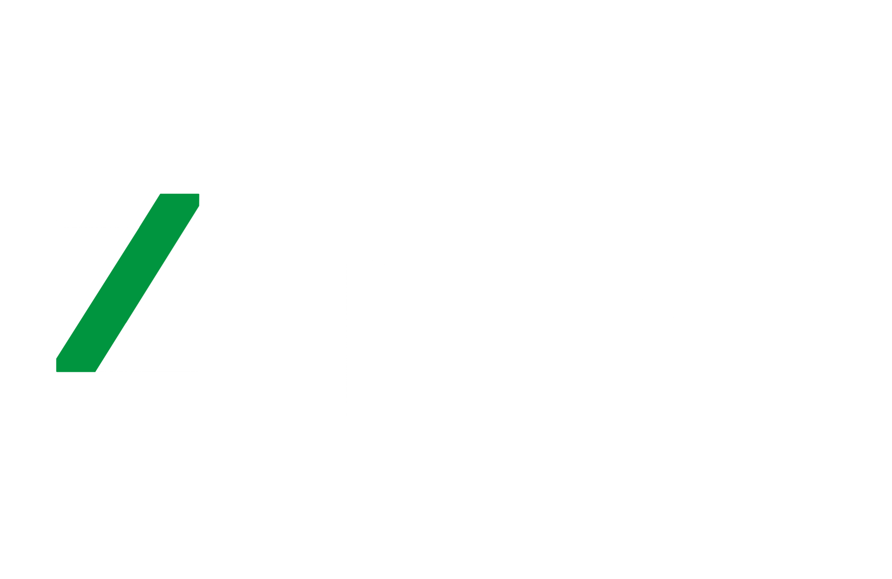

# URL Shortener

A simple and efficient URL shortener that converts long URLs into short, shareable links with tracking features.

## Features

- **Shorten Long URLs**: Convert lengthy web addresses into compact, easy-to-share URLs.
- **Custom Aliases**: Create custom short URLs for branding and better memorability.
- **Analytics**: Track the number of clicks, geographic location, and referrers for each shortened link.
- **Expiration Dates**: Set expiration dates for short URLs, ideal for temporary campaigns.
- **API Support**: Integrate URL shortening functionality into other applications via a simple API.

Access the application at `https://url.zaptian.com/`.

## Usage

1. **Shorten a URL**: Input the long URL you want to shorten, then click "Shorten".
2. **Track Analytics**: Monitor click statistics through the dashboard.
3. **Custom Alias**: Optionally, provide a custom alias for your shortened URL.
